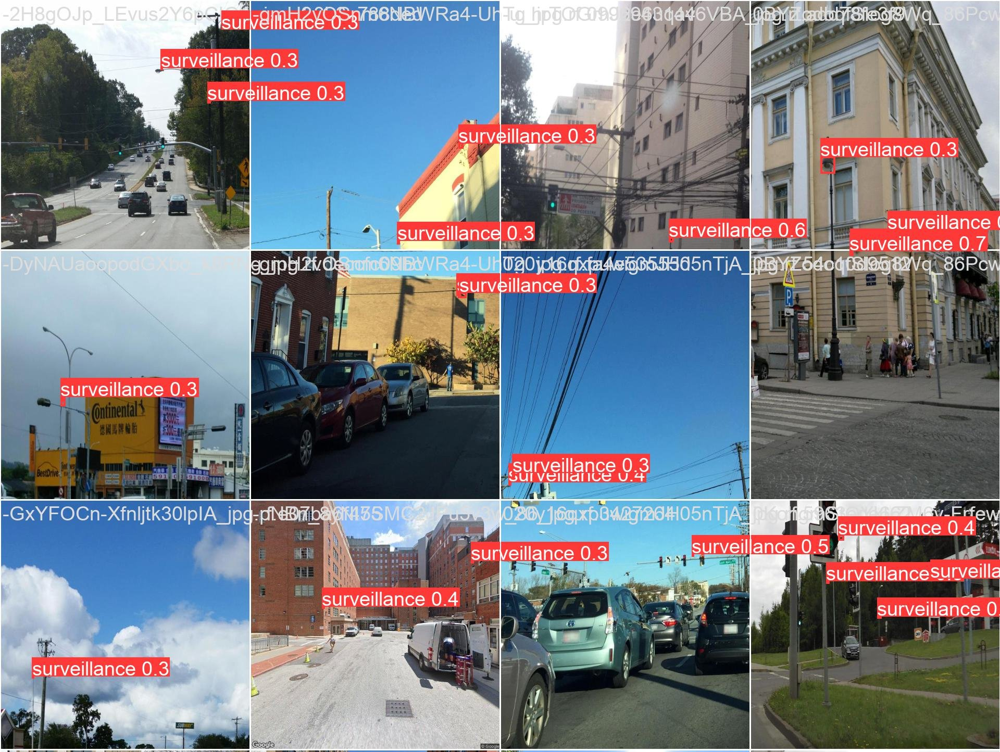

# Re-surveilling surveillance, Camille Seaberry

Prepared for UMBC Data Science Master's Degree Capstone with Dr. Chaojie Wang, Fall 2023

- Code: https://github.com/DATA-606-2023-FALL-MONDAY/seaberry_camille
- Presentation: 
  - Interactive: https://camille-s.github.io/capstone_pres 
  - Static: https://camille-s.github.io/capstone_pres/seaberry_slides.pdf or https://github.com/DATA-606-2023-FALL-MONDAY/seaberry_camille/blob/main/docs/seaberry_final_pres.pdf
- App: 
  - Deployment: https://camilleseab-surveillance.hf.space/
  - Code: https://huggingface.co/spaces/camilleseab/surveillance/tree/main
- Video: https://youtu.be/r8SD8kEfhgw
- Github: https://github.com/camille-s/

