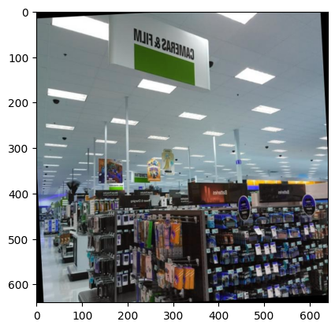
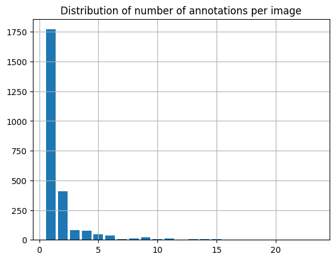
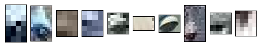
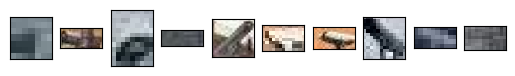

# Proposal

# Re-surveilling surveillance, Camille Seaberry

Prepared for UMBC Data Science Master Degree Capstone with Dr. Chaojie
Wang

- https://github.com/camille-s

## Background

Police surveillance cameras in Baltimore—many of which are situated at
street intersections that make up a spatial network by which people move
through the city—form one of many layers of state surveillance imporsed
upon residents. These cameras are often clearly visible at a distance,
unlike less obvious layers operated by wannabe-state actor-vendors like
Amazon (private Ring cameras subsidized by Amazon and distributed by
police departments such as Baltimore) or Axon (with a monopoly over
body-worn cameras, a band aid offered to counter police violence, and
Tasers, a “less-lethal” potentially lethal high-tech weapon). This
visibility, sometimes including blaringly bright blue lights, creates an
announcement of the fact of being watched. Yet there is little
documentation and even less direct control or oversight of this
landscape, and even crowdsourced data sources like OpenStreetMap have
very little of this landscape recorded. These histories are laid out in
research such as Browne (2015).

I would like to build upon my final project in Data 690: Deep Learning
(Spring 2023). I attempted to recreate aspects of two papers (Turtiainen
et al. (2021); and Sheng, Yao, and Goel (2021)). Both of these papers
train deep learning models on several thousand photos of urban
streetscapes, including those batch downloaded from Google Street View.
Sheng, Yao, and Goel (2021) make their download script available, and
use Baltimore as one of their test cities, so I was able to use a sample
of their images directly. In addition, I used the Objects365 dataset
(Shao et al. (2019)), the only one of the standard image datasets I
could find that specifically had surveillance cameras annotated. Using
these images and a few predefined models from Facebook Research’s
Detectron2 library (Wu et al. (2019)), I trained several neural networks
to identify the locations of surveillance cameras in these images. With
some success, I then developed models with PyTorch to categorize cameras
as directed or global, an additional annotation in the Sheng, Yao, and
Goel (2021) dataset.

The major purposes of those two papers involved mapping the locations of
cameras after detecting them. Because the Street View images can be
downloaded based on their coordinates, once a camera is detected in an
image, its location is known. For my capstone, I have two major
goals: 1) improving upon the models I used, including introduction of
more predefined models (adding YOLO, among others), finer tuning of
classification of camera type (including possibly adding automated
license plate readers), more concerted sampling of intersections in
Baltimore, and updated images; and 2) mapping of those locations to
study the landscape of that layer of surveillance. If possible, my third
goal would be some amount of spatial analysis overlaying camera
locations and socio-economic / demographic data to understand any
patterns in this landscape and the potential burdens of surveillance on
marginalized communities in Baltimore.

## Data & EDA

Source notebook: [./00_eda.ipynb](./00_eda.ipynb)

<div class="quarto-embed-nb-cell"
notebook="/home/camille/code/capstone/docs/00_eda.ipynb"
notebook-title="ann_df =" notebook-cellId="cell-0">

Note that because of the number of images and their size, for now
they’re kept out of the github repo. In addition to the training set I
analyze here, both datasets also have test and validation splits.

``` python
import numpy as np 
import cv2
import random 
import os 
import pandas as pd
import json
from pprint import pprint
from PIL import Image
import matplotlib.pyplot as plt
%matplotlib inline
```

Annotation data was collected from the original data sources (Sheng et
al and Objects365), cleaned up on the Roboflow platform, and re-exported
in COCO format. I created augmented versions of images to increase the
size of the training set by adding randomized small rotations and
horizontal flips. There are two datasets here, one of full images
possibly containing more than one camera in the frame, and one of images
cropped to just the bounding box of a single camera instance.

``` python
with open('../data/cams_coco/train/_annotations.coco.json') as f:
  cams_full = json.load(f)

with open('../data/cams_crop/train/_annotations.coco.json') as f:
  cams_crop = json.load(f)
  
print(f'keys in full images: { cams_full.keys() }')
print(f'keys in cropped images: { cams_crop.keys() }')

print(f'\nexample of annotations for a single image:')
pprint(cams_full['annotations'][0])

print(f'\nexample of metadata for a single image:')
pprint(cams_full['images'][0])
```

    keys in full images: dict_keys(['info', 'licenses', 'categories', 'images', 'annotations'])
    keys in cropped images: dict_keys(['info', 'licenses', 'categories', 'images', 'annotations'])

    example of annotations for a single image:
    {'area': 135,
     'bbox': [554, 246, 15, 9],
     'category_id': 1,
     'id': 0,
     'image_id': 0,
     'iscrowd': 0,
     'segmentation': []}

    example of metadata for a single image:
    {'date_captured': '2023-05-20T17:59:59+00:00',
     'file_name': 'x6NQQwp1XjZv43rNbMBvEA_265_jpg.rf.842d5c5e0d08e84f97063f79c63fe332.jpg',
     'height': 640,
     'id': 0,
     'license': 1,
     'width': 640}

``` python
meta_dfs = {}
meta_dfs['ann'] = {}
meta_dfs['img'] = {}
# ann_df = {}
# img_df = {}
for i, d in [('full', cams_full), ('crop', cams_crop)]:
  ann = pd.DataFrame(d['annotations'])
  ann = ann.set_index('id')
  ann = ann.drop(columns = ['segmentation', 'iscrowd'])
  meta_dfs['ann'][i] = ann
  
  img = pd.DataFrame(d['images'])
  img = img.set_index('id')
  img = img.drop(columns = ['license'])
  meta_dfs['img'][i] = img
 
meta_dfs = {
  k: pd.concat(v.values(), keys = v.keys(), names = ['type']) for k, v in meta_dfs.items()
}
```

Because there can be multiple cameras identified in one full image, the
number of annotations in the full images dataset (4,610) is greater than
the number of images in that same dataset (2,512).

``` python
{ k: v.groupby('type').count().iloc[:, 0] for k, v in meta_dfs.items() }
```

    {'ann': type
     crop    1045
     full    4610
     Name: image_id, dtype: int64,
     'img': type
     crop    1045
     full    2512
     Name: file_name, dtype: int64}

Categories to use for classification: 1 = directional, 2 = globe; 3 =
not classified (Objects365 images are not classified). These are close
to evenly split, with 48% being directional cameras. Directional cameras
have a smaller mean bounding box size, as their bounding boxes are more
oblong. All the cropped images are very small and blurry, however, which
makes classification difficult. Full sized images are uniformly 640 x
640 pixels, but cropped images have mean dimensions of only 12 x 14
pixels.

``` python
meta_dfs['ann'].loc['crop', :] \
  .groupby('category_id') \
  .agg({'image_id': 'nunique', 'area': 'mean'}) \
  .loc[[1, 2], :]
```

<div>
<style scoped>
    .dataframe tbody tr th:only-of-type {
        vertical-align: middle;
    }
&#10;    .dataframe tbody tr th {
        vertical-align: top;
    }
&#10;    .dataframe thead th {
        text-align: right;
    }
</style>

|             | image_id | area       |
|-------------|----------|------------|
| category_id |          |            |
| 1           | 381      | 100.881890 |
| 2           | 418      | 134.880383 |

</div>

``` python
meta_dfs['img'].groupby('type').agg({'height': 'mean', 'width': 'mean'})
```

<div>
<style scoped>
    .dataframe tbody tr th:only-of-type {
        vertical-align: middle;
    }
&#10;    .dataframe tbody tr th {
        vertical-align: top;
    }
&#10;    .dataframe thead th {
        text-align: right;
    }
</style>

|      | height     | width     |
|------|------------|-----------|
| type |            |           |
| crop | 12.155981  | 14.32823  |
| full | 640.000000 | 640.00000 |

</div>

``` python
anns_x_img = pd.merge(
  meta_dfs['ann'].loc['full', :],
  meta_dfs['img'].loc['full', :],
  how = 'left', left_on = 'image_id', right_index = True
)
anns_x_img['n_per_img'] = 1 
anns_x_img = anns_x_img.groupby('image_id').agg({'n_per_img': 'sum'})
```

The vast majority of images have only 1 or 2 cameras marked in them.
Some have upwards of 15; checking for anomalies, it does seem realistic
for some indoor scenes from the Objects365 data to have many cameras.
For example, the highest number of annotations in an image is 24; this
occurs 3 times, but all are augmentations of one image:

``` python
many_cams = anns_x_img.loc[anns_x_img['n_per_img'] > 20, :].index
  
many_cam_id = meta_dfs['img'].iloc[many_cams, :]['file_name'].values[0]
many_cam_img = cv2.imread(os.path.join('../data/cams_coco/train', many_cam_id))
plt.imshow(many_cam_img)
plt.show()
```



``` python
anns_hist = anns_x_img['n_per_img'].hist(bins = range(1, 25), rwidth = 0.8, align = 'left')
anns_hist.set_title('Distribution of number of annotations per image')
plt.show()
```



Finally, a sample of some of the cropped images:

``` python
crop_sample = meta_dfs['ann'].loc['crop'].groupby('category_id').head(10)
crop_sample = crop_sample.loc[crop_sample['category_id'].isin([1, 2]), :]
crop_sample = crop_sample.merge(meta_dfs['img'].loc['crop', :], 
                                how = 'left', left_on = 'image_id', right_index = True)
crop_sample = crop_sample.loc[:, ['image_id', 'category_id', 'file_name']]

  
for cat_id in [1, 2]:
  cat_sample = crop_sample.loc[crop_sample['category_id'] == cat_id, :]
  imgs = [cv2.imread(os.path.join('../data/cams_crop/train', f))
          for f in cat_sample['file_name'].values]
  n = len(imgs)
  fig, axs = plt.subplots(ncols = n, squeeze = False)
  for i in range(n):
    img_grid = plt.subplot(1, 10, i + 1)
    img_grid.imshow(imgs[i])
    img_grid.set_xticks([])
    img_grid.set_yticks([])
  print(f'category: { cat_id }')
  plt.show()
  
```

    category: 1
    category: 2





</div>

## References

<div id="refs" class="references csl-bib-body hanging-indent">

<div id="ref-Browne2015" class="csl-entry">

Browne, Simone. 2015. *Dark Matters: On the Surveillance of Blackness*.
Durham, NC: Duke University Press.

</div>

<div id="ref-S.L.Z+2019" class="csl-entry">

Shao, Shuai, Zeming Li, Tianyuan Zhang, Chao Peng, Gang Yu, Xiangyu
Zhang, Jing Li, and Jian Sun. 2019. “Objects365: A Large-Scale,
High-Quality Dataset for Object Detection.” In *2019 IEEE/CVF
International Conference on Computer Vision (ICCV)*, 8429–38.
<https://doi.org/10.1109/ICCV.2019.00852>.

</div>

<div id="ref-S.Y.G2021" class="csl-entry">

Sheng, Hao, Keniel Yao, and Sharad Goel. 2021. “Surveilling
Surveillance: Estimating the Prevalence of Surveillance Cameras with
Street View Data.” In *Proceedings of the 2021 AAAI/ACM Conference on
AI, Ethics, and Society*, 221–30. AIES ’21. New York, NY, USA:
Association for Computing Machinery.
<https://doi.org/10.1145/3461702.3462525>.

</div>

<div id="ref-T.C.L+2021a" class="csl-entry">

Turtiainen, Hannu, Andrei Costin, Tuomo Lahtinen, Lauri Sintonen, and
Timo Hamalainen. 2021. “Towards Large-Scale, Automated, Accurate
Detection of CCTV Camera Objects Using Computer Vision. Applications and
Implications for Privacy, Safety, and Cybersecurity. (Preprint).” arXiv.
<http://arxiv.org/abs/2006.03870>.

</div>

<div id="ref-detectron" class="csl-entry">

Wu, Yuxin, Alexander Kirillov, Francisco Massa, Wan-Yen Lo, and Ross
Girshick. 2019. “Detectron2.”
<https://github.com/facebookresearch/detectron2>.

</div>

</div>
