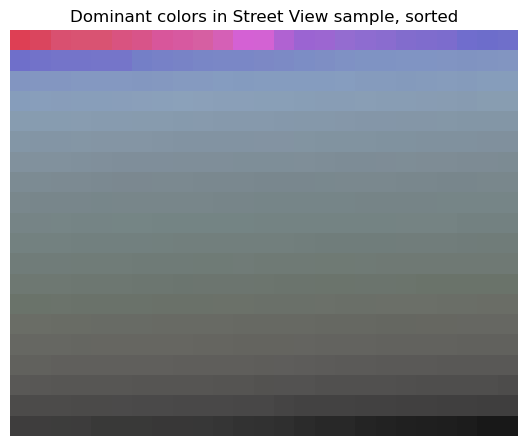

# Report: Re-surveilling surveillance
Camille Seaberry

Prepared for UMBC Data Science Master’s Degree Capstone with Dr. Chaojie
Wang, Fall 2023

- Code: https://github.com/DATA-606-2023-FALL-MONDAY/seaberry_camille
- Presentation:
  - Interactive: https://camille-s.github.io/capstone_pres
  - Static:
    https://camille-s.github.io/capstone_pres/seaberry_slides.pdf or
    https://github.com/DATA-606-2023-FALL-MONDAY/seaberry_camille/blob/main/docs/seaberry_final_pres.pdf
- App:
  - Deployment: https://camilleseab-surveillance.hf.space/
  - Code:
    https://huggingface.co/spaces/camilleseab/surveillance/tree/main
- Video: https://youtu.be/r8SD8kEfhgw
- Github: https://github.com/camille-s

## Background

Police surveillance cameras in Baltimore—many of which are situated at
street intersections that make up a spatial network by which people move
through the city—form one of many layers of state surveillance imposed
upon residents. These cameras are often clearly visible at a distance,
unlike less obvious layers operated by wannabe-state actor-vendors like
Amazon (private Ring cameras subsidized by Amazon and distributed by
police departments such as Baltimore) or Axon (with a monopoly over
body-worn cameras, a band aid offered to counter police violence, and
Tasers, a “less-lethal” potentially lethal high-tech weapon). This
visibility, sometimes including blaringly bright blue lights, creates an
announcement of the fact of being watched. Yet there is little
documentation and even less direct control or oversight of this
landscape, and even crowdsourced data sources like OpenStreetMap have
very little of this landscape recorded. These histories are laid out in
research such as Browne (2015).

I would like to build upon my final project in Data 690: Deep Learning
(Spring 2023). I attempted to recreate aspects of two papers (Turtiainen
et al. (2021); and Sheng, Yao, and Goel (2021)). Both of these papers
train deep learning models on several thousand photos of urban
streetscapes, including those batch downloaded from Google Street View.
Sheng, Yao, and Goel (2021) make their download script available, and
use Baltimore as one of their test cities, so I was able to use a sample
of their images directly. In addition, I used the Objects365 dataset
(Shao et al. (2019)), the only one of the standard image datasets I
could find that specifically had surveillance cameras annotated. Using
these images and a few predefined models from Facebook Research’s
Detectron2 library (Wu et al. (2019)), I trained several neural networks
to identify the locations of surveillance cameras in these images. With
some success, I then developed models with PyTorch to categorize cameras
as directed or global, an additional annotation in the Sheng, Yao, and
Goel (2021) dataset.

The major purposes of those two papers involved mapping the locations of
cameras after detecting them. Because the Street View images can be
downloaded based on their coordinates, once a camera is detected in an
image, its location is known.

For this project, my original goal was to improve upon the models I
used, including introduction of more predefined models (adding YOLO,
among others), finer tuning of classification of camera type (including
possibly adding automated license plate readers), more concerted
sampling of intersections in Baltimore, and updated images. Over the
course of the semester, I developed several variations on two model
types for detection and one for classification to work with decent
accuracy.

Longer term, I’d like to use these models to map locations of cameras to
study the landscape of surveillance. I would like to do some amount of
spatial analysis overlaying camera locations and socio-economic /
demographic data to understand any patterns in this landscape and the
potential burdens of surveillance on marginalized communities in
Baltimore.

Therefore my **major research questions are:**

1.  How accurately can deep learning models detect surveillance cameras
    in street images?
2.  How accurately can deep learning models classify types of
    surveillance cameras?

------------------------------------------------------------------------

## Data

This project uses several non-tabular data sources. As the main part of
this project is object detection in images, the images’ pixel data will
become the features. In the first task (detection), the target is the
bounding box of the detected camera. In the second (classification), the
target is the category of camera.

Once I have locations of cameras from a sample of intersections, the
target would be presence / density of cameras, with geographic
coordinates as the features (spatial regression, kriging, or other
spatial modeling methods).

In the first version of this project, I had two data sources, but I
recently added a third. Labeled images now come from Google Street View
(via Sheng, Yao, and Goel (2021)), the Objects365 dataset (Shao et al.
(2019)), and the Mapillary Vistas dataset (Neuhold et al. (2017)). There
are two types of images, full-sized images (from all 3 sources) and
cropped images (from Street View only). The cropped images were made in
Roboflow by cropping the full-sized images to their objects’ bounding
boxes. Because data came from different sources, standardizing and
unifying annotations was a major task in this project.

Full-sized images’ metadata are in [YOLOv8
format](https://roboflow.com/formats/yolov8-pytorch-txt), where each
image has an associated text file giving bounding box coordinates and
labels. Alongside this metadata are the folders of images. Cropped
images are arranged into folders by class, following the Pytorch
`ImageFolder` model.

The datasets as I’ve assembled them are in public Roboflow projects:

1.  [Street View and Objects365 images for
    detection](https://universe.roboflow.com/seaberry/cap-detect)
2.  [Mapillary Vistas images for
    detection](https://universe.roboflow.com/seaberry/vista-detect)
3.  [Street View images cropped for classification, derived from dataset
    \#1](https://universe.roboflow.com/seaberry/cap-class)

Note that not all images on the platform will end up being used, as
tiled images are filtered so 85% in the final train/validate/test splits
have annotations.

### Source

Sheng, Yao, and Goel (2021); Shao et al. (2019); and Neuhold et al.
(2017), with augmentation and annotation standardization done on the
Roboflow platform.

### Size (jpg files)

- Full-size images: training, validation, and testing sets are 221MB,
  62MB, and 34MB, respectively
- Cropped images: training, validation, and testing sets are 4MB, 664kB,
  and 328kB, respectively

### Dimensions after cleaning

Full-sized images and annotations:

| Data type | Split      | Files |
|:----------|:-----------|------:|
| Images    | Training   | 4,068 |
|           | Validation | 1,155 |
|           | Testing    |   617 |
| Labels    | Training   | 4,068 |
|           | Validation | 1,155 |
|           | Testing    |   617 |

Cropped images:

| Class    | Split      | Files |
|:---------|:-----------|------:|
| Directed | Training   |   517 |
|          | Validation |    75 |
|          | Testing    |    47 |
| Globe    | Training   |   471 |
|          | Validation |    84 |
|          | Testing    |    32 |

### Time period

N/A

### Data dictionary

In the YOLOv8 format, each image has a text file of one or more
annotations with no headings. One row = one marked camera

| Column number | Data type | Definition                              | Values                                           | Use                                   |
|---------------|-----------|-----------------------------------------|--------------------------------------------------|---------------------------------------|
| 1             | Int       | Class                                   | 0, 1, 2, 3 (for detection, I’ve removed classes) | Used to create classification folders |
| 2             | Float     | x-coordinate of the bounding box center | 0-1 scaled relative to image width               | Detection target                      |
| 3             | Float     | y-coordinate of the bounding box center | 0-1 scaled relative to image height              | Detection target                      |
| 4             | Float     | Bounding box width                      | 0-1 scaled relative to image width               | Detection target                      |
| 5             | Float     | Bounding box height                     | 0-1 scaled relative to image height              | Detection target                      |

------------------------------------------------------------------------

## EDA

See standalone notebook: [../src/eda_v2.ipynb](../src/eda_v2.ipynb)

### EDA on training data

#### Metadata

Beyond the data encoded in images, much of the information about the
dataset comes from the annotations. By far, most images have just 1
bounding box, but a few images have 20 or more boxes; images with many
boxes tend to be indoor scenes from Objects365. When creating the
datasets on Roboflow, I included a filter that requires at least 85% of
images in each set have a bounding box in order to deal with the way the
Vista images were cut. 11% of images have no bounding boxes. On average,
bounding boxes only take up about 2% of the width and height of the
image; this is why I am also working with a tiled version of the images.

Cropped images contain one of two classes, either globe cameras or
directed cameras. There are slightly more directed cameras than globe
cameras across each split. One important note is that because the
cameras within images are so small, the cropped images tend to be very
small. YOLO has a minimum size needed for classification, and many of
the cropped images are too small. Directed cameras tend to be much wider
than they are tall, while globe cameras have bounding boxes closer to
square.

Metadata assembled from label text files

|                                                                    | x        | y        | w        | h        |
|--------------------------------------------------------------------|----------|----------|----------|----------|
| id                                                                 |          |          |          |          |
| jr5tX8IrUx1b6JGw7TzGPw_jpg.rf.91a83d31193335775ff28d05edf133ac     | 0.889062 | 0.721875 | 0.060937 | 0.314844 |
| jr5tX8IrUx1b6JGw7TzGPw_jpg.rf.91a83d31193335775ff28d05edf133ac     | 0.010156 | 0.010156 | 0.024219 | 0.015625 |
| objects365_v1_00000926_jpg.rf.0af247e70bf314b1ace00ea1d0b04918     | 0.315625 | 0.331250 | 0.010937 | 0.012500 |
| IZXqv8lvtYUn1SOfZQ7N9w_269_jpg.rf.817322bfc5e0795c4793f783c53e05fa | 0.639844 | 0.402344 | 0.014063 | 0.017188 |
| XXWEd36K6hP98YXNDujDtw_jpg.rf.a91e9cb66cf5aaccdeea2831b038ba06     | NaN      | NaN      | NaN      | NaN      |

Average image width and height by class, cropped training images

|          | w         | h         |
|----------|-----------|-----------|
| type     |           |           |
| directed | 13.007737 | 9.323017  |
| globe    | 8.590234  | 10.380042 |

Summary statistics of image dimensions and bounding box placement, full
training images

|       | x           | y           | w           | h           |
|-------|-------------|-------------|-------------|-------------|
| count | 5278.000000 | 5278.000000 | 5278.000000 | 5278.000000 |
| mean  | 0.379110    | 0.362457    | 0.117132    | 0.120531    |
| std   | 0.318495    | 0.324025    | 0.228987    | 0.230606    |
| min   | 0.001563    | 0.000781    | 0.000781    | 0.000781    |
| 25%   | 0.039844    | 0.035937    | 0.010156    | 0.010937    |
| 50%   | 0.335938    | 0.296094    | 0.017188    | 0.020313    |
| 75%   | 0.657031    | 0.637500    | 0.044531    | 0.054688    |
| max   | 0.998437    | 0.999219    | 0.999219    | 0.999219    |

Descriptive statistics of number of bounding boxes per full-size
training image

    count    4068.000000
    mean        1.297443
    std         1.304801
    min         0.000000
    25%         1.000000
    50%         1.000000
    75%         1.000000
    max        24.000000
    Name: n_boxes, dtype: float64

About 12% of full-size training images have no labeled bounding boxes.
This is advantageous because it will help the models identify cases
where no detections should be made.

The vast majority of images have only 1 or 2 cameras marked in them.
Some have upwards of 15; checking for anomalies, it does seem realistic
for some indoor scenes from the Objects365 data to have many cameras.
For example, of the 6 training images with 15 or more cameras marked,
all but 1 are checkout areas of big box stores, so it makes sense that
so many cameras would be in close proximity. If there were more of these
extreme values I might filter some out, since this is a situation that’s
unlikely for the Street View images I want to use for inference, but
training shouldn’t be thrown off by so few images with more than 3 or so
cameras.

### Analysis of training images for detection

I’m interested in how the images are structured—color, shape, variety.
Street images (both Google Street View and Mapillary Vista) in
particular have clear patterns by design, with a zoomed out panorama
shot of a street that includes the road, sidewalks, buildings, and often
a view of the sky, and are generally taken on non-rainy days. The Street
View images all come from cities chosen by the Stanford researchers, so
they tend to have more gray and beige colors than rural or suburban
shots might. Even though the cameras in the Street View images tend to
be very small, they’re also pretty uniform in color and shape (dark
globe or square for the camera, light casing).

Mapillary images are much larger (median dimensions are 3264 x 2448
pixels), so cameras are larger but also can be washed out by their
surroundings. To deal with that, I’ve kept the first Street View and
Objects dataset separate from the Vista one on Roboflow; I then used the
platform to tile each Vista image into four smaller ones, making them of
more comparable size to the first set. My training script downloads
these two datasets separately, then combines them by training /
validation / testing splits, making a dataset that is more uniform in
size but still varied in content.

#### Color

Because these are the types of images I’d like to run inference on, the
level of predictability in the structure and colors might be beneficial,
because new images will be so reliably similar to the ones the models
are trained on. However, this might also have drawbacks: for example,
Street View images are taken during the daytime, so a model trained on
SV images likely won’t perform well at night, and maybe won’t do as well
in different background (more rural or suburban scenes, indoors, etc).

Here I’m focusing on street scene images because they form a sort of
archetype for inference. With a sample of 500 images, I analyze the
distribution of colors across the sample with histograms. Within the RGB
space, the distributions are most heavily concentrated around middle
values of the three channels, with a spike of strong blue colors
(presumably because the sky is shown in many photos).

To look at this differently, I use k-means clustering to boil the images
down to their most dominant color (using k = 1), then view the
distribution of those dominant colors, most of which are grays and light
blues. This isn’t necessarily the average of the images’ red, green, and
blue components, but the point in color space at which the k-means
clustering algorithm picked its center.

Then I posterize images with k = 3, as a qualitative view of not just
the one most dominant color, but the top few. Colors are clustered per
image, not across the sample, but because of their similarities they all
end up with similar palettes predominantly of beige-gray, light blue,
and off white.

#### Shape

Next I’m interested in the structure of the image scenes. I use
principal components analysis (PCA) to reduce grayscale versions of the
images to fewer dimensions and mimic the eigenfaces used in facial
recognition exercises. The first few components create rather spooky
street scenes, with elements that hint at roads, curbs, crosswalks
(striping pattern in the forefront), building and windows, shapes that
might be overpasses or darker skies, and parked cars. Some also retain
the Google watermark in the bottom left corner. The captured PCs can
then be used to reconstruct images.

While this helps with understanding the image composition overall,
because the cameras are so small I don’t think this will be a very
useful technique in camera detection.

#### Feature mapping

As a more advanced version of the eigenstreets, I am also curious as to
how the images might decompose using simple neural networks. I’ll be
using more complex pretrained models for object detection later, but for
feature mapping a multilayer perceptron will suffice. However, for EDA
I’m just trying this out with scikit-learn training a very weak MLP
without using my GPU, which yields features similar to the eigenstreets.
It’s a bit artificial, since for the full size images I don’t expect to
be doing classification anyway, and only trained on this sample of 500
images without augmentation.

### Classification

Finally, a sample of cropped images:

While I’m using deep learning for both object detection and
classification, the bounding boxes seem like they might be varied enough
by category to use simpler machine learning techniques to build a
reasonable classifier. For example, with no tuning, both naive Bayes and
random forest classifiers perform fairly well, yielding accuracy scores
of 0.75 and 0.88, respectively.

------------------------------------------------------------------------

## Model training and results

After a lot of trial and error and testing out a few different
frameworks, I settled on using Ultralytics YOLOv8 (Jocher, Chaurasia,
and Qiu (2023)). The YOLO family of models have been developed over
several years, and v8 is its latest iteration. These models are
relatively fast, dividing images into grids and estimating
classifications by region within those grids, avoiding more costly
anchor box calculations. The v8 package comes with trainer, tuner, and
predictor modules built in; has weights for a variety of computer vision
tasks; and has a few specialized variations on the YOLO algorithm. I
chose to use the package’s base YOLO model (for both detection and
classification) and the RT-DETR model, a new, transformer-based model
from Baidu (only available for detection). These models are pretrained
on benchmark datasets such as COCO, so I utilized the weights they
already had but fine-tuned them to my datasets; specifically,
surveillance cameras are not a class in the major benchmark datasets, so
I needed to adjust the models from being trained to detect 80 classes to
detecting just one. See details on the original YOLO implementation in
Redmon et al. (2016), and the RT-DETR model in Lv et al. (2023).

Most of the project was done in Python, with some bash scripting to help
with getting and processing data. The main Python packages I used were:

- Pytorch with CUDA
- PIL (for handling images)
- openCV (for handling images)
- pandas (data analysis during EDA)
- ultralytics (models and YOLOv8 ecosystem of modules)
- albumentations (augmentations used by ultralytics)
- roboflow (interfacing with Roboflow platform)
- wandb (uploading artifacts to Weights & Biases)
- sahi (tiling for inference & data cleaning utilities)
- ggplot2 (R, plotting)

In addition to those packages, other tools I used were:

- A Lenovo ThinkPad running Ubuntu 22.04 with 16 cores and 4GB GPU
  (development and tinkering with models before running on Paperspace)
- Roboflow (data management and augmentation)
- Weights & Biases (tracking runs & storing training artifacts)
- Paperspace (virtual machine with 8 CPUs, 16GB GPU, paid hourly)
- conda (environment management between workspaces)
- Hugging Face (hosting app)
- Voila (converting demonstration notebook to an app)
- Docker (containerization of the app)

For both the detection and classification tasks, I used 70/20/10 splits
for training, validation, and testing. I also created some variations on
the data. One issue I found was that the images from Mapillary are about
twice as big as the other two sources; cameras are already generally
very small relative to their images, and this variation made it even
more difficult. To fix this, I uploaded the datasets to Roboflow
separately, then created 2x2 tiles of the Mapillary images before
combining all the sources back together. This made the images come out
to similar dimensions. I also created a version of the dataset where all
images were cut into 3x3 tiles, again addressing the issue of detecting
small objects.

Altogether I trained 8 types of models for detection: for each
architecture (YOLO and RT-DETR), I trained a base model, a model with
all but the last few layers frozen, a model trained on tiled images, and
a model using both freezing and tiling. From there, I chose candidates
to continue tuning and training:

- A YOLO model with medium-sized weights
- YOLO with tiling
- RT-DETR with freezing

I found that the YOLO models are much faster to train—15 epochs can take
less than 30 minutes—but are less accurate and fail to detect some
cameras. Using the tiled dataset improved recall greatly, but doesn’t
necessarily transfer well to full-sized images. RT-DETR takes about 4
times as long, but is much more accurate. The main metric I used for
comparison was mAP 50, though I also paid attention to recall as a
metric that would be important in practice.

<figure>
<figcaption>
Training results, YOLO & RT-DETR models
</figcaption>

</figure>

I then tuned the 2 YOLO models using Ultralytics’ tuning module, which
doesn’t seem to be fully implemented yet for RT-DETR. I also used the
model that had trained on tiled images to tune on full-sized images to
see how well it might transfer. However, tuning gave me pretty
lackluster results that sometimes performed worse than the untuned
models. This could be improved with more iterations and a more
methodical approach to tuning; Weights & Biases has tools for tuning
that use Bayesian probability for choosing hyperparameter values and
would work on both architectures.

<figure>
<figcaption>
Tuning results, YOLO variations only
</figcaption>

</figure>

Because YOLO is a relatively small model and the cropped images for
classification are often no more than 20 pixels on either size, I was
able to do all the training and tuning for classification on my laptop’s
GPU. There are two classes available (globe camera or directed camera),
and these are only labeled on the small subset of images from Street
View, yet the accuracy was quite good even with a small sample size. The
YOLO classifier with medium weights achieves about 96% validation
accuracy after training for 25 epochs, and training and validation takes
just over a minute. However, many of the images are too small to meet
YOLO’s minimum pixel size, shrinking the sample size even further.

<figure>
<figcaption>
Confusion matrix, YOLO medium classifier, validation set
</figcaption>

</figure>

------------------------------------------------------------------------

## Demonstration

I used 2 of the best models to build a demonstration, YOLO trained on
tiled images and RT-DETR trained on tiled images with freezing. I used
Voila to turn a Jupyter notebook into an interactive app, with
JupyterLab widgets for controls. The app takes the text of a location,
such as a street intersection, plus parameters for the image size,
heading (angle), pitch (tilt), and field of view (zoom), and passes
these to the Google Street View static API. This returns an image, which
is then converted from bytes to a PIL Image object. The app then uses
both models to detect surveillance cameras in the image, and plot the
image with predicted bounding boxes overlaid; all three images are
placed side by side for comparison. I chose these two models to showcase
the differences in the architectures: the YOLO model runs quickly but,
in my testing, misses some cameras; the RT-DETR model takes a few
seconds to run, but catches more cameras. As it stands now, the RT-DETR
model is probably too heavy and slow to be useful on a low-RAM machine
or mobile device, or to make predictions in real time on video. I built
this in a Docker container, then deployed it to Hugging Face Spaces,
where it’s publicly available:
https://camilleseab-surveillance.hf.space/.

<figure>
<figcaption>
Screenshot from app
</figcaption>

</figure>

------------------------------------------------------------------------

## Conclusion

Despite having many moving parts that needed to work together, I think
this project was successful. I built models that can detect surveillance
cameras in Street View images on demand and with a fair amount of
accuracy. The main shortcoming here is in tuning: I appreciate having
all the Ultralytics modules work together in one ecosystem, but their
tuner was inadequate for getting better performance of these models with
my limited equipment. I’d like to continue tuning, but switch most
likely to Weights & Biases. The models would likely perform better if
trained for longer—common benchmarks for comparing models often use 300
epochs or more.

I began dabbling in using sliced images for inference with SAHI (Akyon,
Onur Altinuc, and Temizel (2022)); it was from reading the research
behind that that I decided to tile my images, which turned out to work
quite well. One drawback is that if this is done in the app, it might
add more lag time to models that are already not as fast as I’d like.
However, there are frameworks available for optimizing models to perform
inference on smaller CPUs, which I haven’t done.

Even though this is a decent sized dataset with the addition of the
Mapillary images, it could still benefit from being larger. So far,
though, these are the only research datasets I’ve found that have
surveillance cameras labeled, and only Sheng, Yao, and Goel (2021) had
them labeled with different classes. I might go through the images I
already have and use the classification model to add class labels to the
Mapillary and Objects365 images, as well as add labels for types of
cameras more recently deployed, such as automated license plate readers.
I also might use AI labeling assistants to label cameras in other
streetscape datasets to create a larger training set.

Finally, this is just a first step toward using deep learning to study
the landscape of surveillance in Baltimore. The next major piece would
be to sample street intersections, detect cameras and deduplicate the
detections, and use the attached locations for spatial analysis.
Mapillary already has object detections labeled on their mapping
platform, including surveillance cameras, so this might just mean using
their location data and updating or supplimenting it with predictions
from these models.

While it is inherently reactionary to be chasing down the state’s
surveillance tools after they’ve been put up, I do feel there is a place
in surveillance studies and movements for police accountability to
implement open source data science developed by community members.

------------------------------------------------------------------------

## References

Akyon, Fatih Cagatay, Sinan Onur Altinuc, and Alptekin Temizel. 2022.
“Slicing Aided Hyper Inference and Fine-Tuning for Small Object
Detection.” In *2022 IEEE International Conference on Image Processing
(ICIP)*, 966–70. <https://doi.org/10.1109/ICIP46576.2022.9897990>.

Browne, Simone. 2015. *Dark Matters: On the Surveillance of Blackness*.
Durham, NC: Duke University Press.

Jocher, Glenn, Ayush Chaurasia, and Jing Qiu. 2023. “YOLO by
Ultralytics.” <https://github.com/ultralytics/ultralytics>.

Lv, Wenyu, Yian Zhao, Shangliang Xu, Jinman Wei, Guanzhong Wang, Cheng
Cui, Yuning Du, Qingqing Dang, and Yi Liu. 2023. “DETRs Beat YOLOs on
Real-time Object Detection.” arXiv.
<https://doi.org/10.48550/arXiv.2304.08069>.

Neuhold, Gerhard, Tobias Ollmann, Samuel Rota Bulo, and Peter
Kontschieder. 2017. “The Mapillary Vistas Dataset for Semantic
Understanding of Street Scenes.” In *Proceedings of the IEEE
International Conference on Computer Vision*, 4990–99.
<https://openaccess.thecvf.com/content_iccv_2017/html/Neuhold_The_Mapillary_Vistas_ICCV_2017_paper.html>.

Redmon, Joseph, Santosh Divvala, Ross Girshick, and Ali Farhadi. 2016.
“You Only Look Once: Unified, Real-Time Object Detection.” arXiv.
<https://doi.org/10.48550/arXiv.1506.02640>.

Shao, Shuai, Zeming Li, Tianyuan Zhang, Chao Peng, Gang Yu, Xiangyu
Zhang, Jing Li, and Jian Sun. 2019. “Objects365: A Large-Scale,
High-Quality Dataset for Object Detection.” In *2019 IEEE/CVF
International Conference on Computer Vision (ICCV)*, 8429–38.
<https://doi.org/10.1109/ICCV.2019.00852>.

Sheng, Hao, Keniel Yao, and Sharad Goel. 2021. “Surveilling
Surveillance: Estimating the Prevalence of Surveillance Cameras with
Street View Data.” In *Proceedings of the 2021 AAAI/ACM Conference on
AI, Ethics, and Society*, 221–30. AIES ’21. New York, NY, USA:
Association for Computing Machinery.
<https://doi.org/10.1145/3461702.3462525>.

Turtiainen, Hannu, Andrei Costin, Tuomo Lahtinen, Lauri Sintonen, and
Timo Hamalainen. 2021. “Towards Large-Scale, Automated, Accurate
Detection of CCTV Camera Objects Using Computer Vision. Applications and
Implications for Privacy, Safety, and Cybersecurity. (Preprint).” arXiv.
<http://arxiv.org/abs/2006.03870>.

Wu, Yuxin, Alexander Kirillov, Francisco Massa, Wan-Yen Lo, and Ross
Girshick. 2019. “Detectron2.”
<https://github.com/facebookresearch/detectron2>.

